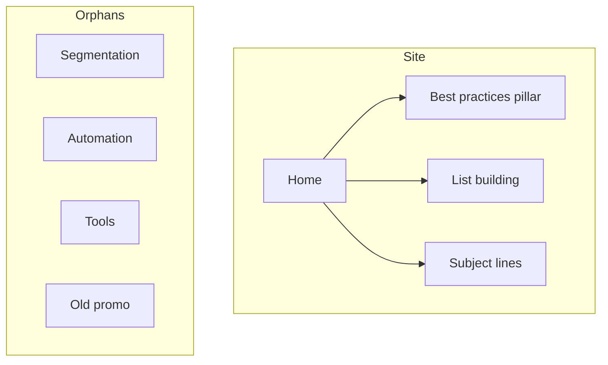
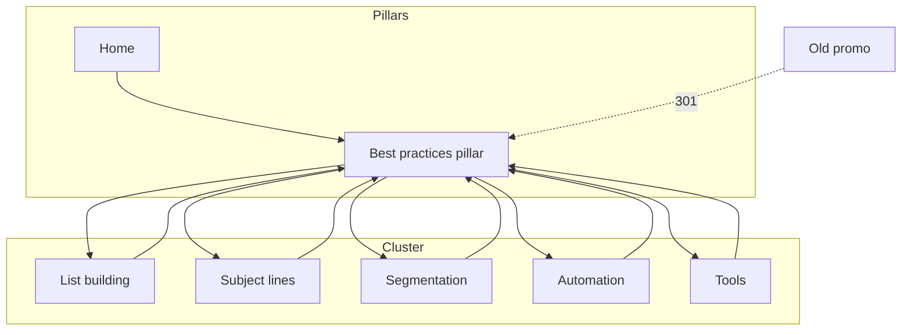

# Linking Example — worked before/after

One worked internal-linking example for a small blog, referenced from the Example section of [SKILL.md](../SKILL.md). All numbers are **Estimated** and illustrative.

## Setup

A 6-page email-marketing blog. New post: **"Email marketing best practices"** (the pillar). Existing spokes: list-building, subject-lines, segmentation, automation, tools. One legacy page (old-promo) sits with no inbound links.

## Before — link graph

Diagnosis (Estimated):
- Pages analyzed: 8 · total internal links: 6 · avg links/page: 0.75 (below hub-spoke target 3–10) → −10
- Orphans: 4 (segmentation, automation, tools, old-promo) → −40
- Pillar has no spoke cross-links; segmentation/automation/tools unreachable
- **Structure score: ~50/100** (100 −10 −40, then floored inputs)

## Contextual Link Plan (Step 5 output)

| # | Source paragraph in pillar | Target | Suggested anchor | Priority |
|---|----------------------------|--------|------------------|----------|
| 1 | "Grow a permission-based list…" | /list-building | building an email list | High |
| 2 | "Write subject lines that earn opens…" | /subject-lines | writing subject lines | High |
| 3 | "Send the right message to the right group…" | /segmentation | audience segmentation | High |
| 4 | "Trigger sequences automatically…" | /automation | email automation | High |
| 5 | "Pick a platform that fits…" | /tools | email marketing tools | Medium |

Each spoke adds one link back to the pillar (spoke → hub). Old-promo has no traffic value → default disposition: 301 to the pillar (see SKILL.md Decision Gate).

## After — link graph

After (Estimated):
- avg links/page: ~2.9 (approaching hub-spoke target) · orphans: 0 · every spoke ≤2 clicks from home
- Anchor mix: 100% descriptive on the 5 new links (no "click here")
- **Structure score: ~95/100** (residual gap: avg links/page still near the low end)

## Takeaway

Adding 5 descriptive contextual links plus 5 return links converted 4 orphans into a reachable cluster and lifted the pillar's inbound signal — no new content, structure only. Broken-target and migration risks (the old-promo 301) hand off to `content-quality-auditor`.
