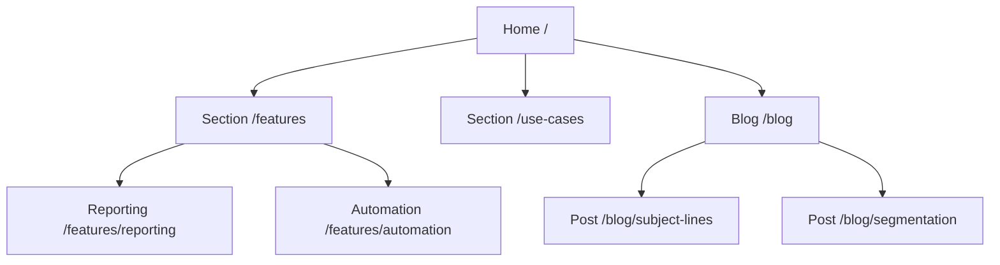
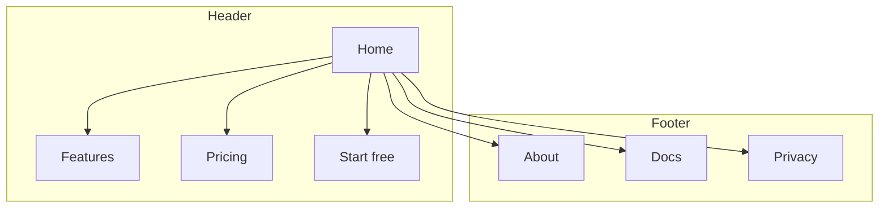
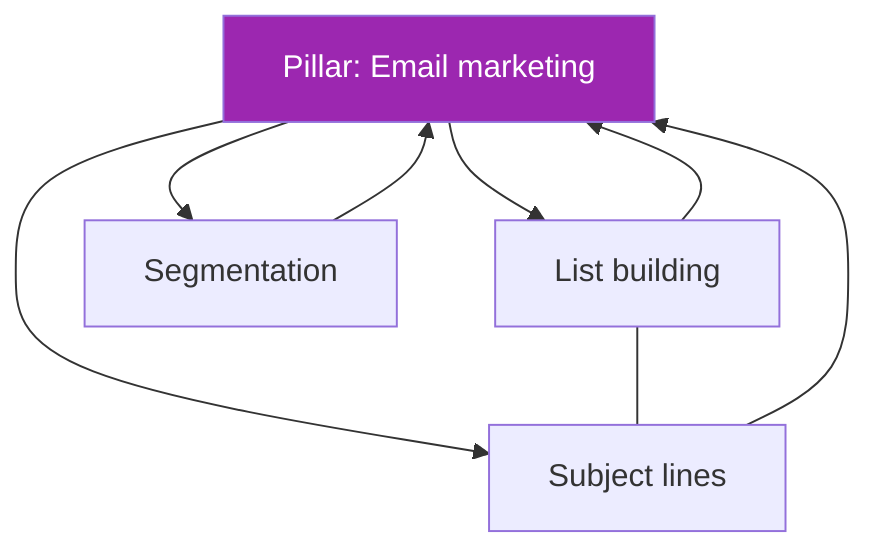
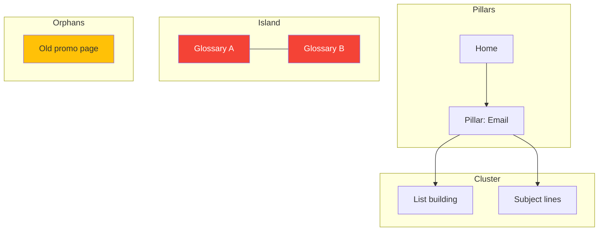
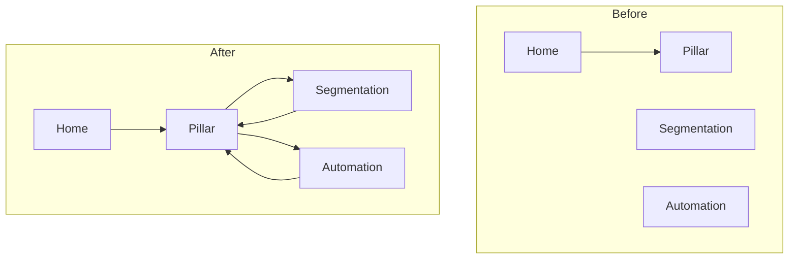
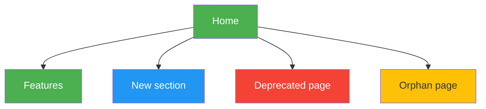

# Mermaid Templates — site hierarchy & link graph

Copy-paste `mermaid` diagrams for architecture Step 7 (Draw the Site Map) and linking-mode site maps in [SKILL.md](../SKILL.md). Paste any block into a Mermaid renderer. Swap the bracketed labels for real pages. Convention: one subgraph per nav zone; orphans in their own subgraph with no inbound edges; islands are clusters that link among themselves but never back to a pillar.

## 1. Hierarchy tree (L0 → L1 → L2/L3)

## 2. Nav zones (header / footer / sidebar)

## 3. Hub/spoke topic cluster

Solid = hub↔spoke links; `---` = cross-links between spokes. Purple = the hub/pillar.

## 4. Orphan & island highlighting

Orphans have no inbound edge; islands cross-link internally but never to a pillar.

Color key: **red** (#f44336) = island (reconnect to a pillar or retire); **yellow** (#FFC107) = orphan (add inbound links, noindex, or 301).

## 5. Before / after (linking mode)

Use `-.301.->` for a planned redirect edge (dotted): `OP[Old promo] -.301.-> B[Pillar]`.

## 6. Color-coding conventions

Apply `style` fills to make the diagnostic view readable at a glance.

Key: **green** (#4CAF50) = existing, no change; **blue** (#2196F3) = new page to create; **red** (#f44336) = remove/redirect or island; **yellow** (#FFC107) = orphan/restructure; **purple** (#9C27B0) = hub or CTA.

## Rendering notes

- `graph TD` = top-down; use `graph LR` for wide, shallow sites.
- Keep node labels short (`page name /url`) so the diagram stays readable.
- One subgraph per nav zone keeps orphans and islands visually separate — the point of the map.
